# System Flow Documentation

## Table of Contents

1. [System Overview](#system-overview)
2. [Component Architecture](#component-architecture)
3. [User Journey](#user-journey)
4. [Feature Interactions](#feature-interactions)
5. [Process Flows](#process-flows)
6. [Data Flow](#data-flow)
7. [Security Flow](#security-flow)
8. [Error Handling](#error-handling)

## System Overview

The Facial Recognition Deduplication System provides a comprehensive workflow for managing facial images, detecting duplicates, and maintaining data integrity. The system integrates multiple components including user authentication, profile management, file uploads, and biometric processing.

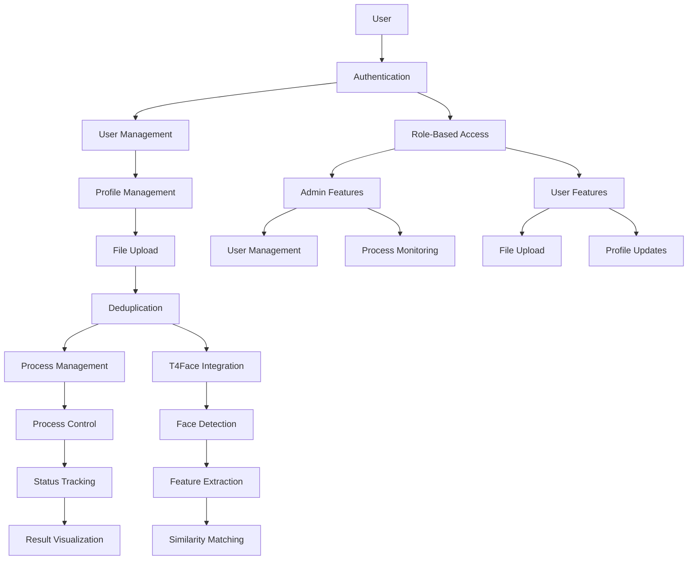

## Component Architecture

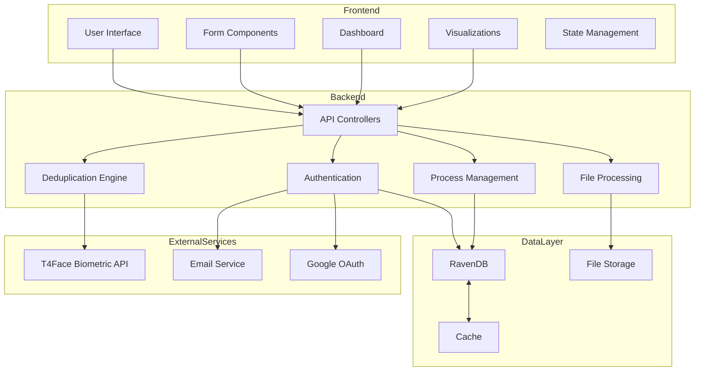

## User Journey

### 1. New User Registration Flow

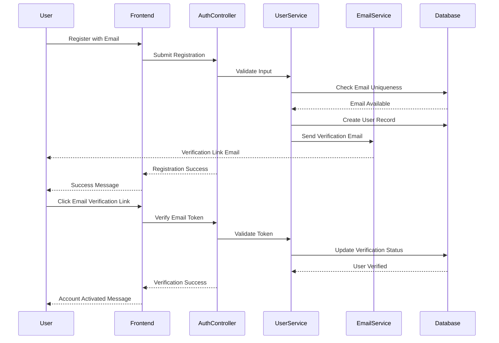

### 2. Authentication Flow

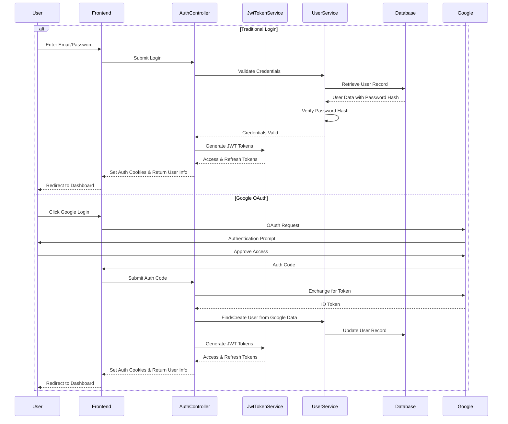

### 3. File Processing Flow

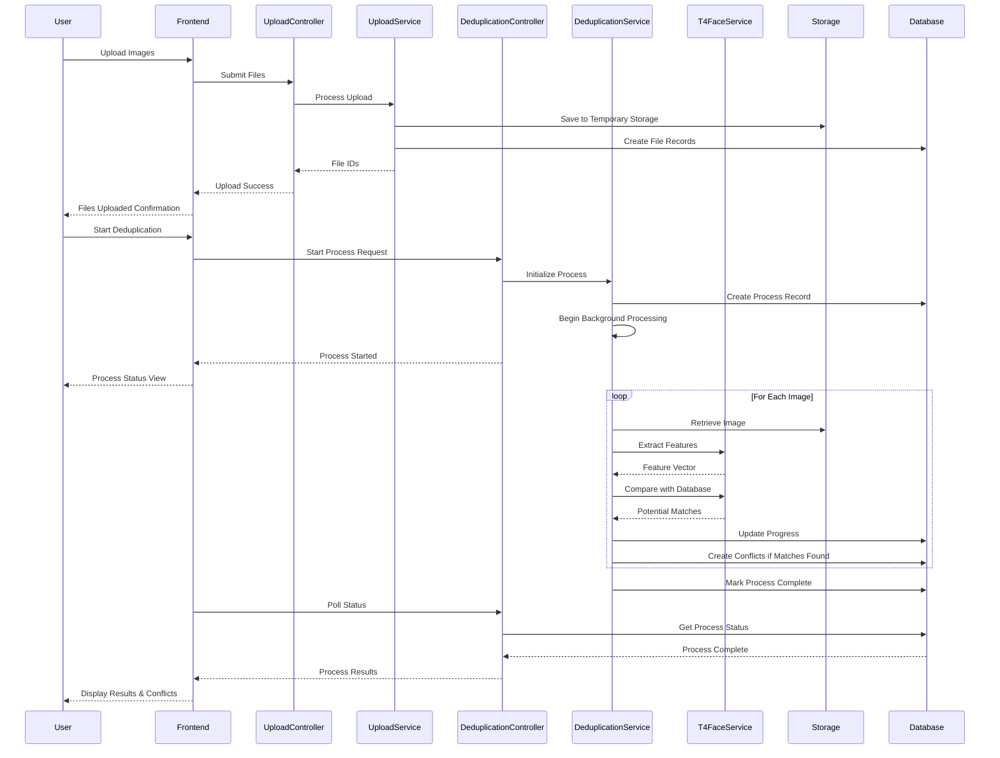

## Feature Interactions

### 1. Authentication & User Management

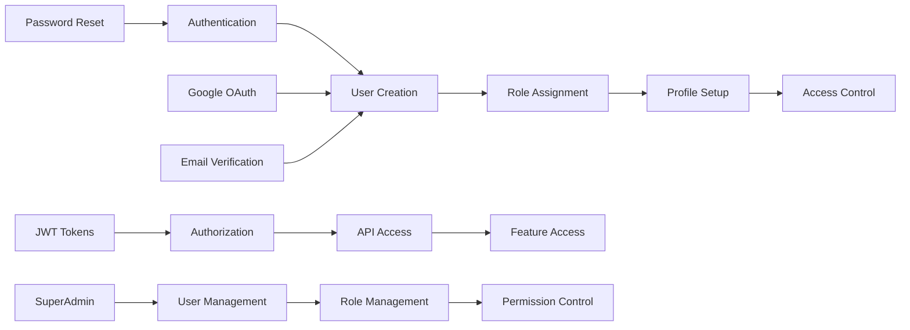

### 2. File Processing & Deduplication

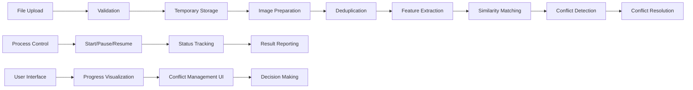

## Process Flows

### 1. Complete User Journey

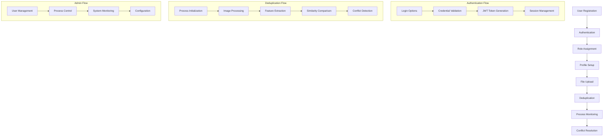

### 2. End-to-End Deduplication Process

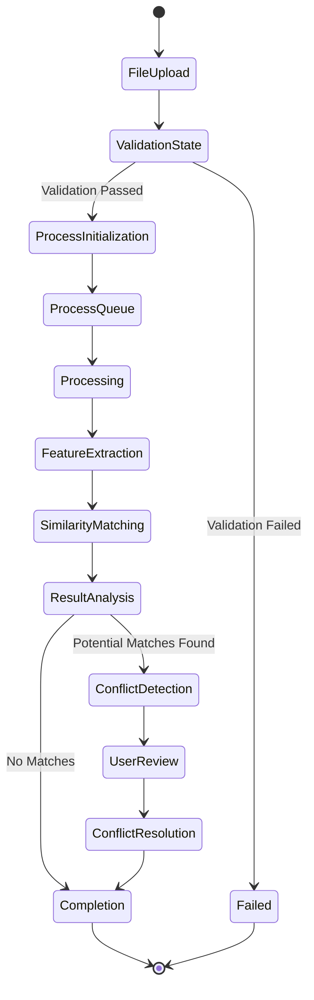

## Data Flow

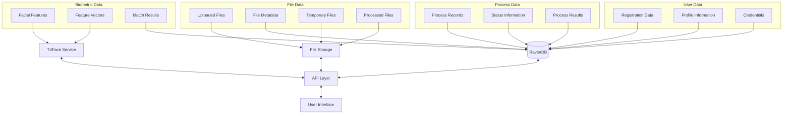

## Security Flow

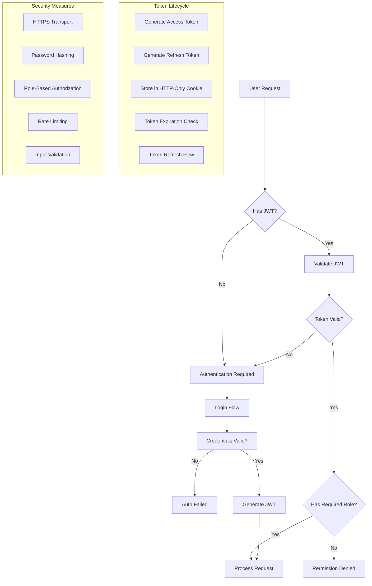

## Error Handling

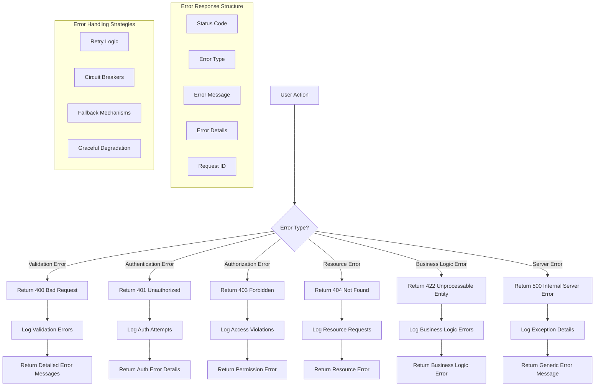

## System States

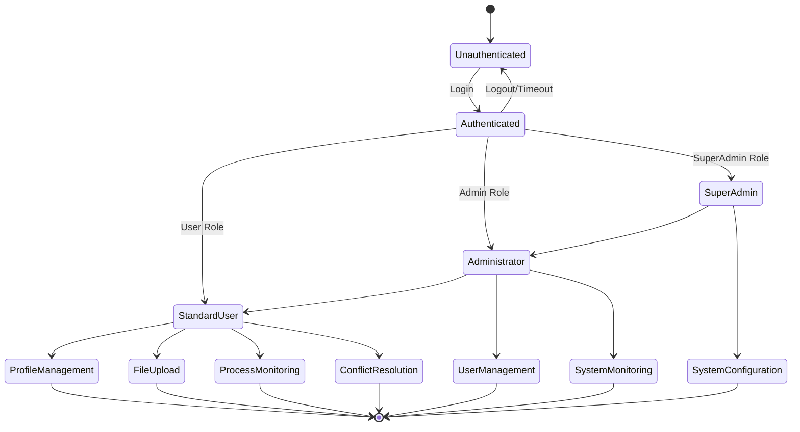

## Feature Dependencies

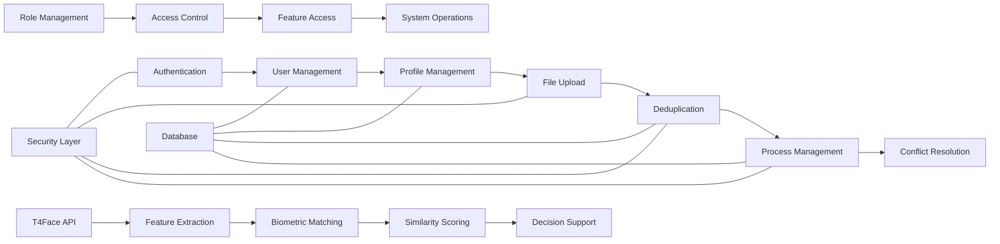
