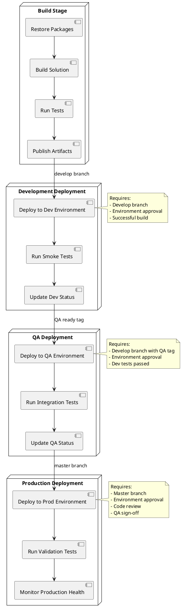

# CI/CD Pipeline Documentation

## Overview

This document describes the continuous integration and continuous deployment (CI/CD) pipeline for the Facial Recognition Deduplication System. The pipeline automates the build, test, and deployment processes across multiple environments to ensure consistent and reliable delivery of software.

## Pipeline Architecture

The CI/CD pipeline is implemented using Azure DevOps Pipelines and consists of multiple stages that progress from code integration to production deployment. Each stage includes specific steps and validation requirements to ensure quality at every phase.

### Pipeline Environments

1. **Development Environment**

   - Purpose: Early testing and verification of new features
   - URL: `https://dedup-dev.example.com`
   - Automatic deployment from develop branch
   - Refreshed database with anonymized data
   - Feature toggles enabled for in-progress features
   - Debugging and monitoring tools enabled

2. **QA Environment**

   - Purpose: Comprehensive testing before production
   - URL: `https://dedup-qa.example.com`
   - Deployment after development validation
   - Stable test data with predefined test cases
   - Integration test suite automation
   - Performance testing capabilities

3. **Production Environment**
   - Purpose: Live system for end users
   - URL: `https://dedup.example.com`
   - Deployment only after full QA validation
   - Real user data with strict security controls
   - Enhanced monitoring and alerting
   - Backup and recovery processes

## Pipeline Stages

### 1. Build Stage

**Restore Packages**

- Retrieves all NuGet dependencies for the .NET 8.0 application
- Uses NuGet package caching to improve build speed
- Validates package integrity and compatibility
- Command: `dotnet restore`

**Build Solution**

- Compiles the application using .NET 8.0 SDK
- Runs code analysis and style enforcement
- Generates documentation from XML comments
- Command: `dotnet build --configuration Release`

**Run Tests**

- Executes unit tests with high code coverage requirements
- Includes integration tests for critical components
- Generates test reports and coverage analysis
- Command: `dotnet test --no-build --configuration Release /p:CollectCoverage=true`

**Publish Artifacts**

- Creates deployment packages for each environment
- Includes necessary configuration transformations
- Archives build artifacts for deployment
- Command: `dotnet publish --no-build --configuration Release --output $(Build.ArtifactStagingDirectory)`

### 2. Development Deployment Stage

**Deploy to Dev Environment**

- Automatically triggered on develop branch commits
- Deploys to Azure Web App for development
- Updates database schema if needed
- Executes post-deployment configuration scripts

**Run Smoke Tests**

- Validates basic functionality is working
- Checks critical system paths
- Verifies API endpoints are responding correctly
- Checks authentication and core features

**Update Dev Status**

- Updates build status in Azure DevOps
- Notifies team of deployment completion
- Tags build as ready for QA if all tests pass
- Generates deployment report with changes included

### 3. QA Deployment Stage

**Deploy to QA Environment**

- Triggered manually or by tagged development builds
- Requires QA environment approval
- Deploys to isolated QA infrastructure
- Runs database migrations with verification

**Run Integration Tests**

- Executes full suite of integration tests
- Performs end-to-end testing of critical flows
- Validates business requirements
- Tests performance under typical load conditions

**Update QA Status**

- Records test results and metrics
- Notifies stakeholders of QA completion
- Tags build as production-ready if approved
- Documents any issues or observations

### 4. Production Deployment Stage

**Deploy to Prod Environment**

- Triggered manually after QA approval
- Requires production deployment approval
- Uses staged deployment to minimize downtime
- Includes automatic rollback capability

**Run Validation Tests**

- Performs minimal-impact validation in production
- Verifies critical business functions
- Checks system health and performance
- Validates integrations with external systems

**Monitor Production Health**

- Activates enhanced monitoring for new deployment
- Tracks error rates and performance metrics
- Monitors user activity and system load
- Alerts on any anomalies or issues

## Required Resources

- **Azure Subscription**: Hosting infrastructure and services
- **Azure Web Apps**: Separate instances for dev, QA, and production
- **Azure SQL Database**: Database for each environment
- **Azure DevOps**: Pipeline execution and code repository
- **Azure Key Vault**: Secure storage for secrets and certificates
- **Application Insights**: Monitoring and diagnostics
- **Azure Storage**: File storage for uploaded content

## Deployment Configuration

- **ARM Templates**: Infrastructure as Code for consistent environments
- **Web.config Transformations**: Environment-specific configurations
- **Release Variables**: Parameter overrides per environment
- **Deployment Slots**: Zero-downtime deployment for production

## Security Controls

- **Approval Gates**: Required approvals for sensitive environments
- **Service Principals**: Least-privilege deployment accounts
- **Environment Isolation**: Separate resource groups and networking
- **Secrets Management**: No hardcoded credentials in pipeline
- **Vulnerability Scanning**: Security analysis during build process

## Rollback Procedures

1. **Automatic Rollback**: Triggered by failed validation tests
2. **Manual Rollback**: Initiated through Azure DevOps Release
3. **Database Rollback**: Script-based schema and data recovery
4. **Infrastructure Rollback**: Reversion to previous ARM deployment

## Monitoring and Alerts

- **Pipeline Status**: Email and Teams notifications
- **Deployment Events**: Tracked in Azure DevOps
- **Application Performance**: Application Insights dashboards
- **System Health**: Azure Monitor alerts
- **Error Tracking**: Centralized logging and notification

## Branch Strategy

- **Feature Branches**: Created from develop for new features
- **Develop Branch**: Integration point for completed features
- **Release Branches**: Created for release candidates
- **Master Branch**: Represents production code
- **Hotfix Branches**: Created from master for critical fixes

## Continuous Improvement

The pipeline includes metrics collection and reporting to identify areas for improvement:

- Build duration and success rate
- Test coverage and reliability
- Deployment frequency and time
- Rollback frequency and recovery time
- Code quality metrics over time
